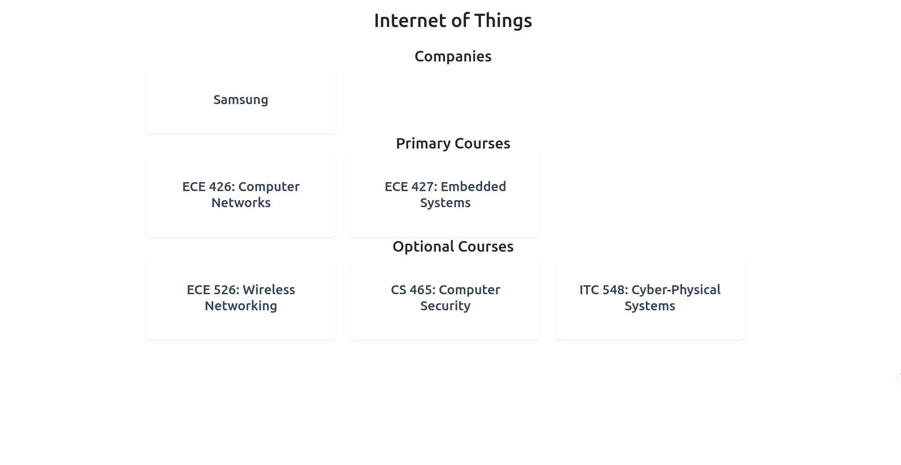

# BYU ECE Tracks

This project is to provide a catalog of Tracks, or rather, technical interest areas that students can pursue during their time in the ECE department at BYU. 


## Authors

- [@romanvish](https://www.github.com/romanvish)


## Features

- Tracks Catalog
- Track detail pages
- Course Catalog
- Course detail pages
- Everything accessible through an admin dashboard
- Filter and search features


## Tech Stack

**Client:** Vue 3, PrimeVue 4, TailwindCSS

**Server:** Node, Express, MongoDB


## Run Locally (for Development)

Clone the project

```bash
  git clone https://github.com/romanvish/BYU-ECE-Tracks.git
```

Go to the project directory

```bash
cd BYU-ECE-Tracks
```

Go to the frontend directory

```bash
  cd frontend
```

Install dependencies

```bash
  npm install
```

Start the frontend

```bash
  npm run dev
```
**In a new terminal**

Go to the project directory

```bash
cd BYU-ECE-Tracks
```

Go to the backend directory

```bash
  cd backend
```

Create a .env file a MongoDB database connection

```bash
  touch .env
```

Install dependencies

```bash
  npm install
```

Start the backend/server

```bash
  node server.js
```
## Style Reference

Please reference (and conform to) BYU Web design style guides as found [here](https://brand.byu.edu/web-theme)

## Roadmap

- Update site to conform to BYU style
- Fix Course Catalog display cards
- Ensure mobile friendliness
- link courses to BYU page perhaps


## Screenshots





README created by [readme.so](https://readme.so)